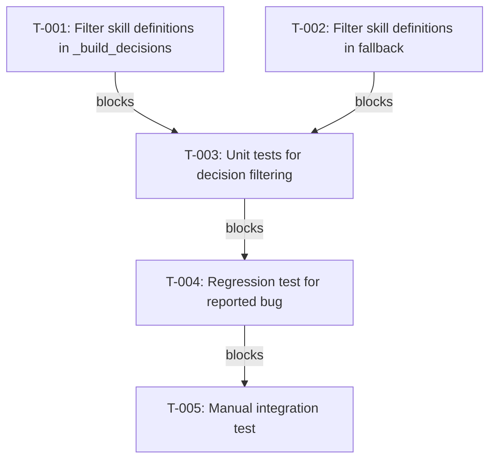

# Plan: Fix Handoff Skill Definition Capture Bugs

## Problem Statement

The handoff system incorrectly captures skill definitions (SKILL.md content) as user goals and decisions, causing context loss after conversation compaction.

**Observed Behavior:**
- After compaction, AI loses context and implements wrong features
- `goal` field contains 722-line SKILL.md content instead of user request
- `decision_register` contains skill definitions as "constraints"

**Root Cause:**
1. Skill definitions appear in transcript as "user" messages (Claude Code injection)
2. `is_meta_instruction()` already filters skill definitions for goal extraction
3. `_build_decisions()` does NOT filter skill definitions
4. Fallback logic uses `extract_last_user_message()` which doesn't filter

## Context Analysis

### Affected Files

| File | Role | Bug |
|------|------|-----|
| `scripts/hooks/__lib/transcript.py` | `is_meta_instruction()` | Missing "Base directory" pattern |
| `scripts/hooks/PreCompact_handoff_capture.py` | `_build_decisions()` | No skill definition filtering |
| `scripts/hooks/__lib/transcript.py` | `extract_last_user_message()` | No skill definition filtering |

### Current State

**`is_meta_instruction()` patterns (transcript.py:323-337):**
```python
meta_patterns = [
    r"^thanks($|[\s,;!])",
    r"^thank you($|[\s,;!])",
    r"^summarize($|[\s,;!])",
    # ... other patterns
    r"^base directory for this skill:",  # <-- EXISTS but not used in decision extraction
]
```

**`_build_decisions()` (PreCompact_handoff_capture.py:192-230):**
- Extracts text from entries
- Matches DECISION_PATTERNS ("must", "do not", "don't", "never")
- No filtering of skill definition content

**Goal extraction fallback (PreCompact_handoff_capture.py:300-303):**
```python
goal = extract_last_substantive_user_message(transcript_path)
if not goal or goal == "Unknown task":
    fallback_goal = parser.extract_last_user_message()  # <-- No filtering!
    goal = fallback_goal or "Unknown task"
```

## Test Discovery

### Existing Tests

| File | Coverage | Notes |
|------|----------|-------|
| `tests/test_canonical_goal_extraction.py` | Goal extraction | Tests `extract_last_substantive_user_message()` |
| `tests/test_handoff_integration.py` | Integration | End-to-end handoff flow |
| `scripts/tests/test_handoff_hooks.py` | Hook tests | Hook execution tests |

### Missing Test Coverage

1. **Decision extraction filtering** - No tests for filtering skill definitions from `_build_decisions()`
2. **Fallback goal filtering** - No tests for `is_meta_instruction()` applied to fallback
3. **Regression test** - No test reproducing the reported bug scenario

### Test Strategy

- **Unit tests**: Test `is_meta_instruction()` with skill definition patterns
- **Integration tests**: Test `_build_decisions()` with mock transcript containing skill definitions
- **Regression test**: Full handoff capture with skill invocation + skill definition in transcript

## Existing Implementation Discovery

### `is_meta_instruction()` Function

Location: `scripts/hooks/__lib/transcript.py:305-350`

Already includes skill definition pattern:
```python
r"^base directory for this skill:",
```

This function IS used in `extract_last_substantive_user_message()` but NOT in:
- `extract_last_user_message()` (fallback)
- `_build_decisions()` (decision extraction)

### Related Tests

- `tests/test_canonical_goal_extraction.py` - Tests goal extraction
- `tests/test_handoff_integration.py` - Integration tests
- No tests for decision extraction filtering

## Proposed Solution

### Strategy

1. **Add skill definition pattern check in `_build_decisions()`**
   - Import `is_meta_instruction()` from transcript module
   - Skip entries where text starts with "Base directory for this skill:"

2. **Fix fallback logic in goal extraction**
   - Apply `is_meta_instruction()` filter to fallback result
   - Ensure fallback never returns skill definitions

3. **Add comprehensive tests**
   - Test decision extraction with skill definitions
   - Test fallback goal extraction with skill definitions
   - Regression test for the reported bug

## Implementation Plan

### Phase 1: Core Fixes

### **TASK-001**: Add skill definition filter to _build_decisions
- **File**: `scripts/hooks/PreCompact_handoff_capture.py`
- **Action**: Import and use `is_meta_instruction()` in decision extraction loop to filter skill definitions
- **Effort**: S
- **Acceptance**: Skill definitions never appear in decision_register
- **Prerequisites**: None

### **TASK-002**: Fix fallback goal extraction to filter skill definitions
- **File**: `scripts/hooks/PreCompact_handoff_capture.py`
- **Action**: Apply `is_meta_instruction()` to fallback result in goal extraction
- **Effort**: S
- **Acceptance**: Fallback never returns skill definitions
- **Prerequisites**: None

### Phase 2: Test Coverage

### **TASK-003**: Write unit tests for decision extraction filtering
- **File**: `tests/test_handoff_decision_filter.py`
- **Action**: Test that skill definitions are filtered from decisions, legitimate constraints pass through
- **Effort**: M
- **Acceptance**: Test passes with skill definition filtered, constraint captured
- **Prerequisites**: TASK-001, TASK-002

### **TASK-004**: Write regression test for the reported bug
- **File**: `tests/test_handoff_regression_skill_capture.py`
- **Action**: Reproduce and verify fix for the reported bug with mock transcript
- **Effort**: M
- **Acceptance**: Goal is user request, decision_register has no skill definitions
- **Prerequisites**: TASK-003

### Phase 3: Verification

### **TASK-005**: Manual integration test with real session
- **File**: N/A (manual testing)
- **Action**: Run skill, trigger compact, verify handoff captures correct context
- **Effort**: S
- **Acceptance**: Handoff JSON shows correct goal and no skill definitions
- **Prerequisites**: TASK-004

## Task Dependency Graph



## Hierarchical Tree View

```
### Phase 1: Core Fixes
├── T-001: Filter skill definitions in _build_decisions
│   ├── 📁 P:\packages\handoff\scripts\hooks\PreCompact_handoff_capture.py
│   ├── ⏱️ Small (30 min)
│   └── 🔗 No dependencies
└── T-002: Filter skill definitions in fallback
    ├── 📁 P:\packages\handoff\scripts\hooks\PreCompact_handoff_capture.py
    ├── ⏱️ Small (15 min)
    └── 🔗 No dependencies

### Phase 2: Test Coverage
├── T-003: Unit tests for decision filtering
│   ├── 📁 P:\packages\handoff\tests\test_handoff_decision_filter.py
│   ├── ⏱️ Medium (1 hour)
│   └── 🔗 Depends on: T-001, T-002
└── T-004: Regression test for reported bug
    ├── 📁 P:\packages\handoff\tests\test_handoff_regression_skill_capture.py
    ├── ⏱️ Medium (1 hour)
    └── 🔗 Depends on: T-003

### Phase 3: Verification
└── T-005: Manual integration test
    ├── 📁 Manual testing
    ├── ⏱️ Small (30 min)
    └── 🔗 Depends on: T-004
```

## Risks, Success Criteria, Dependencies

### Risks

1. **Pattern false positives** - `is_meta_instruction()` might filter legitimate messages
   - Mitigation: Pattern is very specific ("Base directory for this skill:")
   - Low risk - pattern only matches Claude Code's skill injection

2. **Fallback logic edge case** - If all user messages are filtered, goal becomes "Unknown task"
   - Mitigation: This is correct behavior - no substantive goal exists
   - Already handled by existing "Unknown task" logic

### Success Criteria

1. **No skill definitions in goal** - `goal` field never contains SKILL.md content
2. **No skill definitions in decisions** - `decision_register` never contains skill definitions
3. **Skill invocations still captured** - `skill_invocation` decision is added correctly
4. **All tests pass** - Unit tests and regression test verify behavior

### Dependencies

- No external dependencies
- No team coordination required (solo-dev)
- `is_meta_instruction()` already exists with correct pattern

## Rollback Strategy

If issues arise:
1. Revert TASK-001 and TASK-002 changes (simple code removal)
2. Tests will fail, confirming revert is complete
3. Handoff system returns to previous behavior (skill definitions may appear)

## Estimated Effort

| Phase | Tasks | Total Time |
|-------|-------|------------|
| Phase 1: Core Fixes | T-001, T-002 | 45 min |
| Phase 2: Test Coverage | T-003, T-004 | 2 hours |
| Phase 3: Verification | T-005 | 30 min |
| **Total** | 5 tasks | **3.25 hours** |

## Next Actions

1. `TASK-001`: Add `is_meta_instruction()` filter to `_build_decisions()`
2. `TASK-002`: Add filter to fallback goal extraction
3. `TASK-003`: Write unit tests for decision filtering
4. `TASK-004`: Write regression test
5. `TASK-005`: Manual integration test
