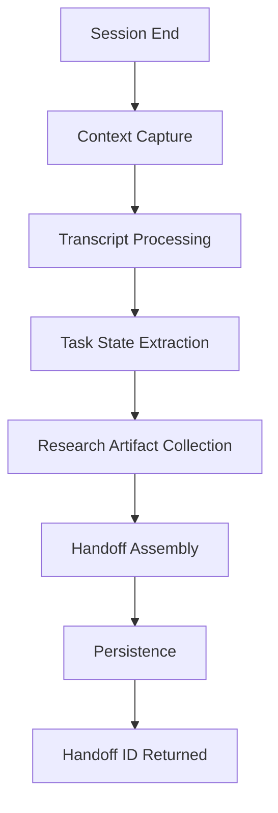

# Architecture Design

## Overview

`handoff` is a research-backed handover documentation system that creates comprehensive session continuations between AI interactions. It captures conversation context, research findings, and task state for seamless resumption.

## Core Components

```
handoff/
├── core/
│   ├── handoff_manager.py    # Main orchestration
│   ├── context_capture.py    # Conversation context extraction
│   ├── state_tracker.py      # Task state persistence
│   └── transcript_processor.py # Chat history processing
├── storage/
│   ├── handoff_store.py      # File-based persistence
│   ├── models.py             # Data models (Handoff, Session, etc.)
│   └── serialization.py      # JSON/YAML serialization
├── research/
│   ├── artifact_collector.py # Research outputs gathering
│   └── source_tracker.py     # Source/provenance tracking
├── cli/
│   └── commands.py           # CLI entry points
└── templates/
    ├── handoff_template.md   # Handoff document structure
    └── quick_reference.md    # Quick reference section
```

## Design Philosophy

### Research-Backed Handover

The system emphasizes **evidence-based handovers**:

1. **Traceability**: Every claim cites sources (transcript excerpts, file paths)
2. **Reproducibility**: Handoffs contain sufficient context to resume work
3. **Continuity**: Preserves conversation flow, not just snapshots

### Separation of Concerns

```
┌─────────────────────────────────────────┐
│           Handoff Manager              │
│  (Orchestration, workflow coordination) │
└────────────┬─────────────┬──────────────┘
             │             │
    ┌────────▼─┐     ┌────▼────────┐
    │ Context  │     │   Storage   │
    │ Capture  │     │   Layer     │
    └──────────┘     └─────────────┘
         │                   │
    ┌────▼─────┐       ┌────▼──────┐
    │ Research │       │ Filesystem│
    │ Artifacts│       │ / SQLite  │
    └──────────┘       └───────────┘
```

## Key Design Patterns

### 1. Builder Pattern

**Location**: `core/handoff_manager.py`

Handoff documents are built incrementally:

```python
handoff = HandoffBuilder() \
    .with_session_metadata(session_id, timestamp) \
    .with_conversation_context(transcript) \
    .with_task_state(tasks) \
    .with_research_artifacts(artifacts) \
    .build()
```

### 2. Repository Pattern

**Location**: `storage/handoff_store.py`

Abstracts storage backend (filesystem vs. database):

```python
class HandoffStore(ABC):
    @abstractmethod
    def save(self, handoff: Handoff) -> str:
        """Save handoff, return ID"""
        pass

    @abstractmethod
    def load(self, handoff_id: str) -> Handoff:
        """Load handoff by ID"""
        pass
```

### 3. Strategy Pattern

**Location**: `core/transcript_processor.py`

Different transcript formats (Claude Code, ChatGPT, generic) use different extraction strategies:

```python
class TranscriptExtractor(ABC):
    @abstractmethod
    def extract_context(self, transcript: str) -> ConversationContext:
        pass

class ClaudeCodeExtractor(TranscriptExtractor):
    def extract_context(self, transcript: str) -> ConversationContext:
        # Claude Code-specific parsing
```

## Data Flow



## Data Models

### Handoff Structure

```python
@dataclass
class Handoff:
    id: str                          # Unique identifier
    timestamp: datetime              # Creation time
    session_id: str                  # Source session
    quick_reference: QuickReference  # TL;DR section
    conversation_summary: Summary    # Conversation overview
    task_state: TaskState            # Active/pending tasks
    research_artifacts: List[Artifact] # Sources, findings
    transcript_path: str             # Link to full transcript
    metadata: Dict[str, Any]         # Extensible metadata
```

### Quick Reference (TL;DR)

```python
@dataclass
class QuickReference:
    session_id: str
    timestamp: datetime
    transcript_path: str              # Path to previous chat
    citation: str                     # Handoff citation ID
    active_tasks: List[str]           # Current work
    key_decisions: List[str]          # Important choices made
    next_steps: List[str]             # Recommended actions
```

## Storage Architecture

### Filesystem Structure

```
handoffs/
├── {session_id}/
│   ├── handoff.json           # Complete handoff
│   ├── quick_reference.md     # TL;DR section
│   ├── full_report.md         # Detailed handoff
│   └── artifacts/             # Research outputs
│       ├── sources/
│       ├── findings/
│       └── diagrams/
```

### SQLite Schema (Optional Backend)

```sql
CREATE TABLE handoffs (
    id TEXT PRIMARY KEY,
    session_id TEXT NOT NULL,
    timestamp DATETIME DEFAULT CURRENT_TIMESTAMP,
    quick_reference TEXT,  -- JSON
    full_report TEXT,       -- Markdown
    transcript_path TEXT,
    metadata JSON
);
```

## Extension Points

### Adding New Transcript Formats

1. Implement `TranscriptExtractor` for format
2. Register in `TranscriptProcessorRegistry`
3. Add format detection logic

### Adding New Storage Backends

1. Implement `HandoffStore` interface
2. Add backend configuration to `handoff.yml`
3. Register in `StorageFactory`

### Custom Handoff Templates

1. Create template in `templates/`
2. Define variable mapping
3. Register in `TemplateRegistry`

## Trade-offs

| Aspect | Choice | Rationale |
|--------|--------|-----------|
| Storage | Filesystem first | Simple, portable, git-friendly |
| Format | JSON + Markdown | Machine-readable + human-readable |
| Index | Simple file scan | Low volume, no complex queries needed |
| Compression | Optional gzip | Large handoffs can be compressed |

## Dependencies

- **External**: `pyyaml` (config), `rich` (CLI formatting)
- **Dev**: `pytest`, `pytest-cov`, `ruff`, `mypy`

## Security Considerations

- Transcript paths are validated to prevent directory traversal
- Handoff IDs are UUID v4 to prevent enumeration
- Sensitive data in transcripts is not redacted (user responsibility)

## Future Enhancements

- [ ] Redaction strategies for sensitive data
- [ ] Handoff diff/comparison tool
- [ ] Handoff merge (multiple sessions → one)
- [ ] Integration with Claude Code's session system
- [ ] Handoff sharing/collaboration features
