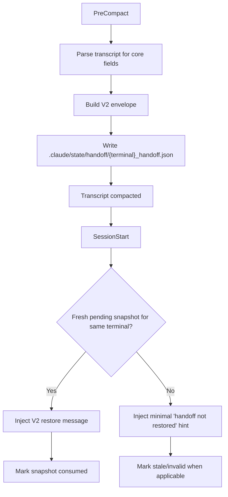
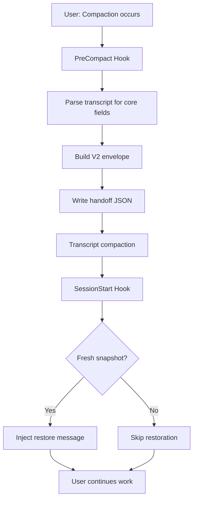

# handoff

[](https://github.com/EndUser123/P/actions/workflows/test.yml)
[](https://github.com/EndUser123/P/tree/main/packages/handoff#verification)
[](https://github.com/EndUser123/P/tree/main/packages/handoff/CHANGELOG.md)
[](LICENSE)

> Compact/resume continuity for Claude Code using a small, deterministic V2 handoff envelope.

## Quick Start

**Installation** (3 minutes):

```powershell
# 1. Clone the repository
git clone https://github.com/EndUser123/P.git
cd P/packages/handoff

# 2. For local development (recommended)
# Create junctions for hook files
cd P:/.claude/hooks
cmd /c "mklink PreCompact_handoff_capture.py P:\packages\handoff\core\hooks\PreCompact_handoff_capture.py"
cmd /c "mklink SessionStart_handoff_restore.py P:\packages\handoff\core\hooks\SessionStart_handoff_restore.py"

# 3. Verify installation
pytest P:/packages/handoff/tests/ -q
```

**What it does**: Captures terminal state before transcript compaction and restores it on session start, preserving your work context across compactions and multi-terminal workflows.

## What handoff Does

The handoff system captures a per-terminal snapshot before transcript compaction and restores it on the next post-compact session start. The current implementation is a hard-cut V2 design:

- **One handoff file per terminal** - Each terminal gets its own handoff state
- **One authoritative schema** - V2 envelope with resume snapshot, decision register, evidence index, and checksum
- **No backward compatibility reads** - Clean V2 design without legacy restore indirection
- **No automatic fallback** - Stale or invalid snapshots are marked as rejected

### V2 Data Model

Each handoff file contains:

- **`resume_snapshot`** - Current task, progress, blockers, active files, pending operations, next step
- **`decision_register`** - Explicit decisions (constraints, settled decisions, blocker rules, anti-goals) with bridge tokens
- **`evidence_index`** - Reference-only supporting context (files, transcripts, tests, logs, git)
- **`checksum`** - SHA256 validation for data integrity
- **`quality_score`** (optional) - Session completeness rating (0.0-1.0)

#### Optional V2 Fields

The V2 schema supports optional fields for advanced features:

- **`bridge_token`** (decision_register) - Cross-session decision continuity token
- **`quality_score`** (resume_snapshot) - Session quality metric based on completion tracking

### Active Flow



### Restore Policy

Automatic restore is allowed only when all of the following are true:

- Same terminal ID
- `status == pending`
- Restore source is an actual post-compact session start
- Snapshot is within the freshness window (default: 20 minutes)

**Behavior**:
- Fresh snapshot → Inject restore message and mark `consumed`
- Stale snapshot → Inject stale hint and mark `rejected_stale`
- Invalid checksum/schema → Inject rejection hint and mark `rejected_invalid`
- Generic startup → Do not restore and do not consume

## Development and Deployment

### Three Deployment Models

**IMPORTANT**: This package supports three different deployment modes. Choose the right one for your use case.

#### 1. HOOKS (Dev Deployment) ⭐ **Recommended for Development**

**For**: When you're actively developing this package and want instant feedback.

**Setup**:
```powershell
# Symlink individual hook files to P:/.claude/hooks/
cd P:/.claude/hooks

# Symlink the two main hook files
cmd /c "mklink PreCompact_handoff_capture.py P:/packages/handoff/scripts/hooks/PreCompact_handoff_capture.py"
cmd /c "mklink SessionStart_handoff_restore.py P:/packages/handoff/scripts/hooks/SessionStart_handoff_restore.py"
```

**Key points**:
- ✅ Edit in `P:/packages/handoff/`, changes work immediately
- ✅ No reinstallation required - symlinks auto-load
- ✅ Perfect for active development
- ⚠️ **CRITICAL**: After migration to scripts/, check for broken symlinks pointing to old `core/` paths

#### 2. PLUGINS (End User Deployment)

**For**: Distributing this package to other users via marketplace or GitHub.

**Setup**:
```bash
# End users install via /plugin command
/plugin P:/packages/handoff

# Or from marketplace (when published)
/plugin install handoff
```

**Key points**:
- ✅ Plugin copied to `~/.claude/plugins/cache/`
- ✅ Registered in `~/.claude/plugins/installed_plugins.json`
- ❌ **NOT for local development** - requires reinstall on every change
- ✅ Use for distributing finished packages to users

### Which Model Should You Use?

| Your Situation | Use This Model | Why |
|----------------|----------------|-----|
| Actively developing this package | **HOOKS** (symlinks) | Instant feedback, no reinstall |
| Distributing to end users | **PLUGINS** (/plugin) | Proper distribution format |

### Verification

Run tests to verify installation:

```bash
# Quick test
pytest P:/packages/handoff/tests/ -q

# Comprehensive test
pytest P:/packages/handoff/scripts/tests/test_handoff_hooks.py -q
pytest P:/packages/handoff/tests/test_canonical_goal_extraction.py -q
pytest P:/packages/handoff/tests/test_pending_operations_extraction.py -q
```

**Expected output**: All 103 tests pass.

## Architecture Flowchart



## Handoff Files Structure

The package source in [`scripts/hooks`](scripts/hooks) is authoritative. Key files:

- **Hook Entry Points**:
  - [`PreCompact_handoff_capture.py`](scripts/hooks/PreCompact_handoff_capture.py) - Captures state before compaction
  - [`SessionStart_handoff_restore.py`](scripts/hooks/SessionStart_handoff_restore.py) - Restores state on session start

- **Core Library**:
  - [`handoff_v2.py`](scripts/hooks/__lib/handoff_v2.py) - V2 envelope schema and validation
  - [`handoff_files.py`](scripts/hooks/__lib/handoff_files.py) - File I/O and state management
  - [`handoff_store.py`](scripts/hooks/__lib/handoff_store.py) - Quality scoring algorithm
  - [`bridge_tokens.py`](scripts/hooks/__lib/bridge_tokens.py) - Bridge token generation
  - [`transcript.py`](scripts/hooks/__lib/transcript.py) - Transcript parsing for goal extraction

- **V1 Integration**:
  - [`config.py`](scripts/config.py) - Cleanup configuration (`cleanup_old_handoffs`)
  - [`cli.py`](scripts/cli.py) - Command-line interface for debugging

- **Configuration**:
  - [`hooks/hooks.json`](hooks/hooks.json) - Hook registration

## Feature Documentation

### Automatic Cleanup

Old handoff files are automatically cleaned up before creating new ones. The `cleanup_old_handoffs()` function removes stale handoffs based on file age and retention policies.

**Configuration**: Configure retention via `HANDOFF_FRESHNESS_MINUTES` (default: 20 minutes).

### Bridge Tokens

Each decision in the decision register includes a `bridge_token` field for cross-session continuity:

```json
{
  "id": "dec_abc123",
  "kind": "constraint",
  "summary": "Never auto-restore stale snapshots",
  "bridge_token": "BRIDGE_20260316-142730_stale_snapshot"
}
```

Tokens are generated using the format: `BRIDGE_YYYYMMDD-HHMMSS_TOPIC_KEYWORD`

### Quality Scoring

Handoff quality is computed from multiple factors:

| Component | Weight | Description |
|-----------|--------|-------------|
| Completion Tracking | 30% | Resolved issues vs total modifications |
| Action-Outcome Correlation | 25% | Blocker presence indicates incomplete work |
| Decision Documentation | 20% | Number of decisions captured |
| Issue Resolution | 15% | Absence of blocker indicates resolution |
| Knowledge Contribution | 10% | Patterns learned captured |

**Quality Ratings**:
- **0.9-1.0**: Excellent - Comprehensive documentation
- **0.7-0.8**: Good - Well-documented with minor gaps
- **0.5-0.6**: Acceptable - Basic documentation with gaps
- **<0.5**: Needs Improvement

### CLI Tool

Handoff V2 includes a command-line interface for debugging and manual operations:

```bash
# Show restore status for current terminal
python -m scripts.cli restore

# List handoff details
python -m scripts.cli list

# Debug mode (validation, checksum, decisions)
python -m scripts.cli debug

# Clean up old handoffs (dry-run)
python -m scripts.cli cleanup --dry-run

# Clean up old handoffs (execute)
python -m scripts.cli cleanup
```

### Transcript Extraction

The capture hook extracts only core continuity fields from the transcript:

- Substantive user goal (skips meta-instructions like "thanks", "summarize")
- Planning blockers
- Active files
- Pending operations (Read, Grep, Glob, Edit, Bash, Skill tools)
- Next step (inferred from pending operations → assistant text → goal fallback)
- Explicit decisions and constraints

### Session Boundary Detection

The system detects session boundaries using `session_chain_id` changes and stops extraction to prevent crossing into unrelated sessions.

### Topic Shift Detection

Uses semantic similarity with 30% threshold to detect when the user has changed topics, preventing restoration of stale context.

### Checksum Validation

SHA256 checksums validate data integrity. Invalid snapshots are rejected with a clear error message.

## System Requirements

- **Platform**: Windows, macOS, Linux (multi-platform support)
- **Python**: 3.9+ (for tests and development)
- **Claude Code**: Latest version with hooks support

## Contributing

Contributions are welcome! Please see [CONTRIBUTING.md](CONTRIBUTING.md) for guidelines.

## License

MIT License - see [LICENSE](LICENSE) for details.

## Changelog

See [CHANGELOG.md](CHANGELOG.md) for version history and updates.

**Recent highlights**:
- v0.3.0 - Migrated to scripts/ for plugin standards compliance (core/ → scripts/)
- v0.2.2 - Fixed incorrect task extraction (reversed iteration bug + tool_result extraction bug)
- All 103 tests passing with comprehensive coverage
