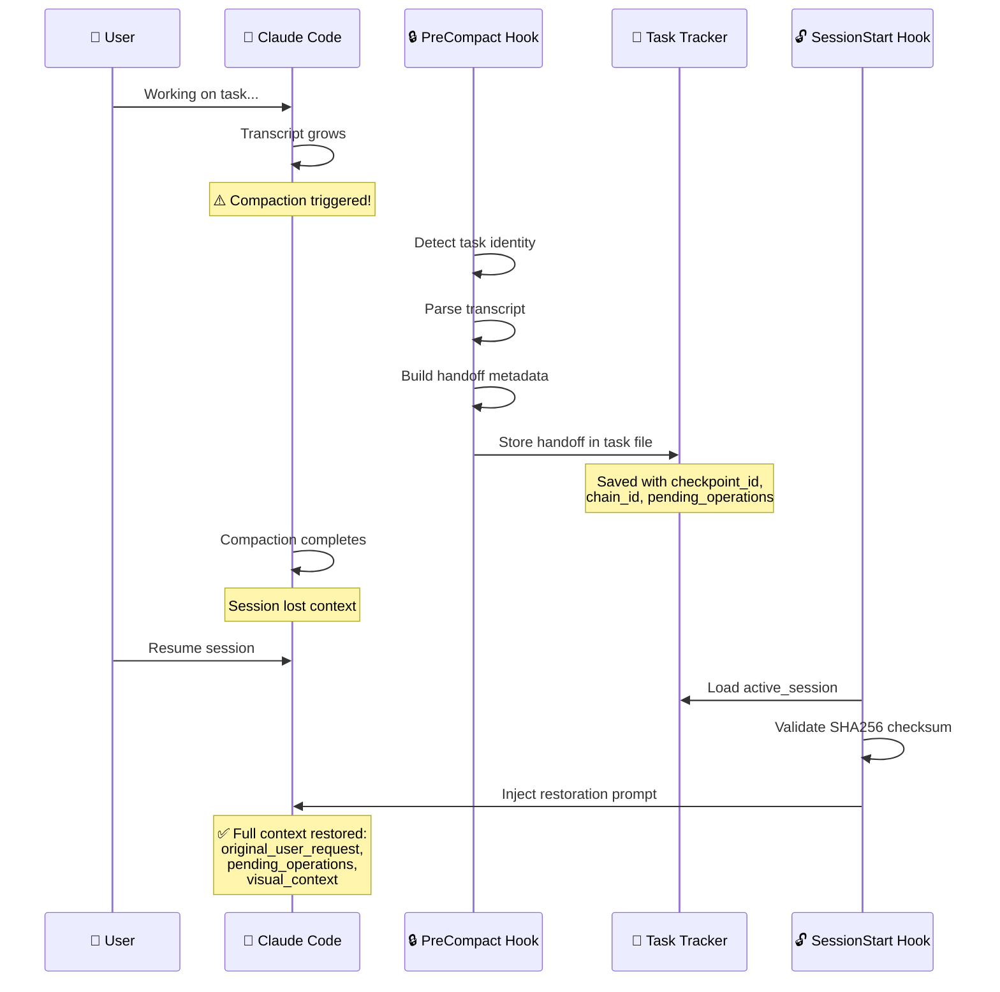

# handoff

> Session handoff management for AI coding environments - capture, restore, and manage conversation state across compaction events

[](https://github.com/EndUser123/handoff/actions) [](https://pypi.org/project/handoff/) [](https://pypi.org/project/handoff/) [](https://opensource.org/licenses/MIT)

## 📚 Documentation

| Document | Description |
|----------|-------------|
| [ARCHITECTURE.md](ARCHITECTURE.md) | System architecture, data models, and design patterns |
| [examples/](examples/) | Usage examples and integration patterns |
| [docs/adr/](docs/adr/) | Architecture Decision Records |
| [CHANGELOG.md](CHANGELOG.md) | Version history and changes |

## Quick Start

```bash
# 1. Install the package
pip install -e packages/handoff/

# 2. Create junction for Claude Code skill
powershell -Command "New-Item -ItemType Junction -Path 'P:\.claude\skills\handoff' -Target 'P:\packages\handoff\skill'"

# 3. Run tests to verify
pytest packages/handoff/tests/ -v

# 4. Use the /hod skill in Claude Code
/hod "summarize my current work"
```

**That's it!** The handoff system will now automatically capture your session state before transcript compaction and restore it when you resume.

## Overview

**handoff** provides automatic session state capture and restoration for Claude Code. It preserves conversation context across transcript compaction events, ensuring work continuity with full user intent, visual evidence, and incomplete operations.

## Features

- **Automatic State Capture**: Hook-based capture before transcript compaction
- **Automatic State Restoration**: Seamless restoration on session resume
- **Checkpoint Chains**: Parent/child linking for traversing related states
- **Fault Tolerance**: Tracks incomplete operations (edit, test, read, command, skill)
- **Visual Context Preservation**: Screenshots and image analysis survive compaction
- **Full User Message**: Never truncated - the authentic source of user intent
- **Terminal Isolation**: Per-terminal state prevents cross-contamination
- **SHA256 Validation**: Checksums ensure data integrity
- **Zero External Dependencies**: Pure Python standard library

## Key Capabilities

- **Session Continuity**: Maintain work context across compaction events
- **Image Preservation**: Screenshots and visual evidence retained
- **Operation Tracking**: Detect incomplete edits, tests, reads, commands
- **Seamless Restoration**: Resume work exactly where you left off
- **Hook Integration**: Automatic capture via PostToolUse and SessionStart hooks

## Installation

### As Python Package (Production)

```bash
# Install from source
pip install packages/handoff/

# Or editable mode for development
pip install -e packages/handoff/
```

### As Claude Code Skill (Development)

For local development, create a junction from Claude skills to the package:

**Windows (Junction - Recommended)**
```powershell
# Create junction from Claude skills to package
New-Item -ItemType Junction -Path "P:\.claude\skills\handoff" -Target "P:\packages\handoff\skill"
```

**Linux/Mac (Symlink)**
```bash
# Create symlink from Claude skills to package
ln -s "P:/packages/handoff/skill" "~/.claude/skills/handoff"
```

### From GitHub

```bash
# Clone to local packages directory
git clone https://github.com/csf-nip/handoff.git P:/packages/handoff

# Then create junction/symlink as shown above
```

## Architecture

### System Overview



### Package Structure

```
handoff/
├── src/handoff/
│   ├── __init__.py              # Package exports
│   ├── protocol.py               # HandoffStorage Protocol interface
│   ├── config.py                 # Configuration and paths
│   ├── models.py                 # HandoffCheckpoint, PendingOperation dataclasses
│   ├── checkpoint_ops.py         # PendingOperation with validation
│   ├── migrate.py                # Checksum computation, migration utilities
│   ├── checkpoint_chain.py       # CheckpointChain traversal
│   └── hooks/
│       └── __lib/
│           ├── transcript.py      # TranscriptParser, TranscriptLines
│           ├── handoff_store.py  # HandoffStore (build_handoff_data)
│           ├── handover.py       # HandoverBuilder
│           ├── task_identity_manager.py  # 6-source task identity recovery
│           └── bridge_tokens.py  # Cross-session continuity tokens
├── tests/                        # 217 tests, all passing
└── skill/SKILL.md               # /hod skill documentation
```

## Core Components

### HandoffStorage Protocol

Type-safe interface for storage systems:

```python
from handoff.protocol import HandoffStorage
from typing import runtime_checkable

@runtime_checkable
class HandoffStorage(Protocol):
    def save_handoff(self, task_name: str, terminal_id: str, data: dict) -> Path: ...
    def load_handoff(self, task_name: str, terminal_id: str, strict: bool = True) -> dict | None: ...
    def list_handoffs(self, task_name: str, terminal_id: str) -> list[Path]: ...
    def delete_handoff(self, task_name: str, terminal_id: str, version: int) -> bool: ...
```

### TranscriptParser

Extract session data from Claude Code transcript JSON:

```python
from handoff.hooks.__lib.transcript import TranscriptParser

parser = TranscriptParser(transcript_path="~/.claude/projects/P--/transcript.json")

# Extract various session elements
blocker = parser.extract_current_blocker()
modifications = parser.extract_modifications()
last_message = parser.extract_last_user_message()  # FULL, untruncated
decisions = parser.extract_session_decisions()
patterns = parser.extract_session_patterns()
visual_context = parser.extract_visual_context()
pending_ops = parser.extract_pending_operations()

# Resume capability
offset = parser.get_transcript_offset()  # Character position
count = parser.get_transcript_entry_count()  # Entry count
```

### HandoffStore

Build handoff metadata with checkpoint chain support:

```python
from handoff.hooks.__lib.handoff_store import HandoffStore
from pathlib import Path

store = HandoffStore(
    project_root=Path("P:/"),
    terminal_id="term_abc123"
)

# Build complete handoff data
handoff_data = store.build_handoff_data(
    task_name="implement-feature-x",
    progress_pct=45,
    blocker={"description": "Need to clarify requirements"},
    files_modified=["src/main.py"],
    next_steps=["1. Write tests", "2. Implement core logic"],
    handover={"decisions": [...], "patterns_learned": [...]},
    modifications=[...],
    pending_operations=[
        {"type": "edit", "target": "src/main.py", "state": "in_progress"}
    ]
)

# Returns dict with checkpoint_id, parent_checkpoint_id, chain_id, etc.
```

### CheckpointChain

Traverse related checkpoints:

```python
from handoff.checkpoint_chain import CheckpointChain
from pathlib import Path

chain = CheckpointChain(
    task_tracker_dir=Path(".claude/state/task_tracker"),
    terminal_id="term_abc123"
)

# Get all checkpoints in a chain
checkpoints = chain.get_chain(chain_id="abc-123-def")

# Get latest checkpoint
latest = chain.get_latest(chain_id="abc-123-def")

# Navigate
previous = chain.get_previous(checkpoint_id="xyz-789")
next_cp = chain.get_next(checkpoint_id="xyz-789")
```

### Data Models

```python
from handoff.models import HandoffCheckpoint, PendingOperation

# Create typed checkpoint
checkpoint = HandoffCheckpoint(
    checkpoint_id="abc-123",
    parent_checkpoint_id=None,
    chain_id="chain-456",
    created_at="2025-02-17T12:00:00Z",
    transcript_offset=12345,
    transcript_entry_count=42,
    task_name="implement-feature-x",
    task_type="feature",
    progress_percent=50,
    blocker=None,
    next_steps="Complete the work",
    git_branch="main",
    active_files=["src/main.py"],
    recent_tools=[],
    transcript_path="/transcript.json",
    handover=None,
    open_conversation_context=None,
    visual_context=None,
    resolved_issues=[],
    modifications=[],
    original_user_request="Add feature X",
    first_user_request="Add feature X",
    saved_at="2025-02-17T12:00:00Z",
    version=1,
    implementation_status=None,
    pending_operations=[
        PendingOperation(
            type="edit",
            target="src/main.py",
            state="in_progress",
            details={"line": 42}
        )
    ],
    checksum="sha256:abc123..."
)

# Serialize/deserialize
data_dict = checkpoint.to_dict()
restored = HandoffCheckpoint.from_dict(data_dict)
```

### Migration Utilities

Backward compatibility support for legacy handoffs:

```python
from handoff.migrate import migrate_checkpoint_chain_fields, migrate_old_handoff_to_checkpoint

# Migrate old handoff to new checkpoint format
new_checkpoint = migrate_old_handoff_to_checkpoint(old_handoff_data)

# Add checkpoint chain fields to existing handoff
updated = migrate_checkpoint_chain_fields(handoff_data)
```

### Bridge Tokens

Cross-session continuity tokens for tracking decisions across compactions:

```python
from handoff.hooks.__lib.bridge_tokens import generate_bridge_token, extract_bridge_tokens

# Generate a bridge token for a decision
token = generate_bridge_token(
    topic="authentication",
    timestamp="2026-02-12T14:05:30Z"
)
# Returns: "BRIDGE_20260212-140530_AUTHENTICATION"

# Extract all bridge tokens from handoff data
tokens = extract_bridge_tokens(handoff_data)
```

### Task Identity Manager

5-source resilience chain for task identification after compaction:

```python
from handoff.hooks.__lib.task_identity_manager import TaskIdentityManager

manager = TaskIdentityManager(project_root=Path("P:/"))

# Recover task identity from multiple sources
# 1. Environment variable (TASK_NAME)
# 2. Session file
# 3. Compact metadata
# 4. Git worktree mapping
# 5. User confirmation
metadata = manager.recover_task_identity()
```

### Quality Assessment

Handoff quality scoring and validation:

```python
from handoff.migrate import calculate_quality_score, validate_handoff_size

# Calculate handoff quality score (0.0-1.0)
score = calculate_quality_score(handoff_data)

# Validate handoff size limits
validation = validate_handoff_size(handoff_data)
```

## Claude Code Hook Integration

The handoff system integrates with Claude Code via two hooks:

### Development Setup

For local development, hook source files live in the package and are symlinked to Claude's hooks directory:

**Windows (Symlink - Requires Admin)**
```powershell
# Create symlink from Claude hooks to package source
# Run PowerShell as Administrator
New-Item -ItemType SymbolicLink -Path "P:\.claude\hooks\PreCompact_handoff_capture.py" -Target "P:\packages\handoff\src\handoff\hooks\PreCompact_handoff_capture.py"
New-Item -ItemType SymbolicLink -Path "P:\.claude\hooks\SessionStart_handoff_restore.py" -Target "P:\packages\handoff\src\handoff\hooks\SessionStart_handoff_restore.py"
```

**Why this pattern?**
- Source of truth is in the package (`src/handoff/hooks/`)
- Edit files in the package, hooks automatically pick up changes
- Enables version control and distribution of hook code
- Matches the skill junction pattern (see "As Claude Code Skill" above)

### PreCompact Hook

Captures session state before transcript compaction:

**Location**: `.claude/hooks/PreCompact_handoff_capture.py`

**Flow**:
1. Detect current task (6-source resilience chain)
2. Parse transcript for session data
3. Build handoff metadata with checkpoint chain IDs
4. Create `continue_session` task in terminal-scoped task tracker

**Output**: Handoff stored in `.claude/state/task_tracker/{terminal_id}_tasks.json`

### SessionStart Hook

Restores session state on resume:

**Location**: `.claude/hooks/SessionStart_handoff_restore.py`

**Flow**:
1. Load `active_session` task from task tracker
2. Validate schema and SHA256 checksum
3. Build restoration prompt with full context
4. Inject into conversation via JSON output

**Critical**: `original_user_request` is displayed WITHOUT truncation - this is the authentic source of user intent.

## Configuration

Environment variables:

| Variable | Default | Description |
|----------|---------|-------------|
| `HANDOFF_PROJECT_ROOT` | `P:/` | Project root directory |
| `HANDOFF_RETENTION_DAYS` | `90` | Days before auto-cleanup |
| `MAX_VERSIONS` | `20` | Max versions to retain |

## Data Flow

```
┌─────────────────────────────────────────────────────────────────┐
│                      SESSION ACTIVE                             │
├─────────────────────────────────────────────────────────────────┤
│  User works → Transcript grows → Files modified                │
└────────────────────────────┬────────────────────────────────────┘
                             │
                             ▼
┌─────────────────────────────────────────────────────────────────┐
│                  COMPACTION TRIGGERED                           │
├─────────────────────────────────────────────────────────────────┤
│  PreCompact_handoff_capture.py:                                 │
│  1. Detect task identity                                       │
│  2. Parse transcript → extract blocker, mods, visual context   │
│  3. Build handoff with checkpoint_id, chain_id                │
│  4. Store in task tracker metadata                             │
└────────────────────────────┬────────────────────────────────────┘
                             │
                             ▼
┌─────────────────────────────────────────────────────────────────┐
│                  AFTER COMPACTION                               │
├─────────────────────────────────────────────────────────────────┤
│  SessionStart_handoff_restore.py:                               │
│  1. Load active_session task                                    │
│  2. Validate checksum                                           │
│  3. Build restoration prompt:                                   │
│     - Full original_user_request (NOT truncated)                │
│     - Pending operations                                        │
│     - Visual context                                            │
│     - Handover decisions/patterns                               │
│  4. Inject into conversation                                    │
└────────────────────────────┬────────────────────────────────────┘
                             │
                             ▼
┌─────────────────────────────────────────────────────────────────┐
│                    SESSION RESUMED                                │
├─────────────────────────────────────────────────────────────────┤
│  LLM has full context of what user was working on              │
└─────────────────────────────────────────────────────────────────┘
```

## Testing

```bash
cd packages/handoff

# Run all tests
pytest

# Run with coverage
pytest --cov=handoff --cov-report=term-missing

# Run specific test file
pytest tests/test_checkpoint_chain.py -v
```

**Test Coverage**: 217 tests covering:
- PendingOperation creation and validation
- HandoffCheckpoint serialization
- Checkpoint chain linking and traversal
- Backward compatibility with old handoffs
- Migration idempotency

## Development

### Examples

See [examples/](examples/) for usage examples:
- **[basic_usage.py](examples/basic_usage.py)** - Basic handoff save/load, checkpoint chains, and serialization

### Setup Development Environment

```bash
cd packages/handoff

# Create virtual environment
python -m venv venv
venv\Scripts\activate  # Windows

# Install with dev dependencies
pip install -e ".[dev,test,docs]"
```

### Code Quality

```bash
# Format code
black src/ tests/

# Lint code
ruff check src/ tests/

# Type checking
mypy src/
```

## Key Design Decisions

### 1. Hook-Based Architecture (No CLI)

The package is hook-only - no CLI commands. All capture and restoration happens automatically via Claude Code hooks.

### 2. Task-Based Storage

Handoff data is stored directly in task tracker metadata, eliminating dual storage redundancy.

### 3. Full User Message Preservation

`original_user_request` is NEVER truncated. This is the authentic source of user intent and must survive compaction unchanged.

### 4. Terminal Isolation

Each terminal gets its own task file (`{terminal_id}_tasks.json`), preventing cross-terminal handoff contamination.

### 5. Checkpoint Chains

Handoffs form chains via `checkpoint_id`, `parent_checkpoint_id`, `chain_id`, enabling traversal through related states.

### 6. Fault Tolerance

`pending_operations` tracks incomplete work, enabling recovery after compaction or interruption.

## Troubleshooting

### Common Issues

**Issue: "Handoff not capturing before compaction"**
- **Cause**: Hooks not installed or not triggered
- **Fix**:
  ```bash
  # Verify hooks are installed
  ls P:/.claude/hooks/PreCompact_*.py

  # Check hook configuration in CLAUDE.md
  grep -A5 "PreCompact" P:/.claude/CLAUDE.md
  ```

**Issue: "Restoration creates duplicate state"**
- **Cause**: Multiple terminals restoring same checkpoint
- **Fix**: Each terminal should restore independently. The system uses terminal isolation to prevent conflicts.

**Issue: "Checkpoint file not found on restore"**
- **Cause**: Checkpoint expired or was cleaned up
- **Fix**:
  - Check `.claude/handoffs/` directory for available checkpoints
  - Use `/hod list` to see available checkpoints
  - Recent checkpoints are prioritized in restoration

**Issue: "Images not preserved in handoff"**
- **Cause**: Image paths not captured or images too large
- **Fix**:
  - Verify image analysis is enabled in configuration
  - Check file size limits for embedded images
  - Use `--include-visual-context` flag when capturing

**Issue: "Terminal ID not detected"**
- **Cause**: Running in environment without terminal identification
- **Fix**:
  - Ensure CLAUDE_CODE_TERMINAL_ID environment variable is set
  - Check session context includes terminal identification
  - Fall back to session-based handoff if terminal ID unavailable

### Debug Mode

Enable verbose logging for troubleshooting:

```bash
# Set environment variable before starting Claude Code
export HANDOFF_DEBUG=true
export HANDOFF_LOG_LEVEL=DEBUG

# Or modify configuration in CLAUDE.md
```

### Verification Commands

```bash
# List all checkpoints
/hod list

# Show checkpoint details
/hod show <checkpoint-id>

# Verify hooks are installed
ls -la P:/.claude/hooks/PreCompact_*.py
```

### Getting Help

- **Documentation**: See CONTRIBUTING.md for development setup
- **Issues**: Report bugs at https://github.com/csf-nip/handoff/issues
- **Security**: See SECURITY.md for vulnerability reporting

## License

MIT License - see [LICENSE](LICENSE) file for details.

## Contributing

Contributions are welcome! Please see [CONTRIBUTING.md](CONTRIBUTING.md) for guidelines.

## Version

0.2.0
